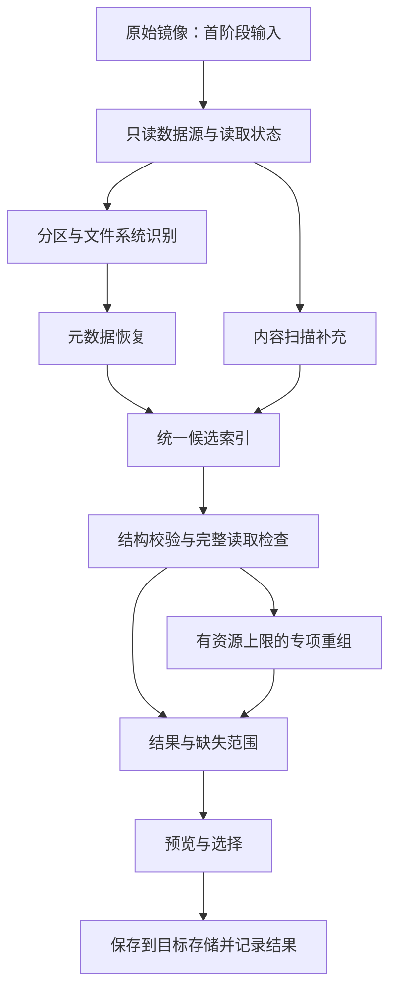

# 数据恢复软件调研：功能实现、研发路线与超越条件

调研日期：2026-09-12。交付性质：公开资料与开源代码核查，以及由此提出的研发方案；尚未运行竞品恢复实验，尚未形成我们优于任何产品的性能或恢复率证据。

配套材料：[8 组竞品功能矩阵](competitor-matrix.md)、[开源组件与源码核查](opensource-audit.md)、[对照测试方案](benchmark-plan.md)。

产品定位更新：用户随后接受了 Windows 普通用户误删恢复、NTFS 优先的方向。当前开发范围见[第一版产品说明](../product-brief.md)。本文保留技术研究判断；exFAT/JPEG 专项及其预算作为后续实验参考，不作为首版前置任务或当前工期。

## 1. 立项判断

这项产品可以分两步成立：先以成熟组件实现可用的免费恢复软件，再用可复现的故障样本寻找专项算法的提升空间。首版不应承担完整替代所有专业套件的目标。

本轮调研得到五个决定研发方向的结论：

1. **成熟软件通常组合多种恢复路径。** 文件系统元数据恢复、文件内容扫描、分区识别和专项重组共同决定结果。只有 PhotoRec 内容扫描不足以覆盖保留文件名、目录、已知碎片位置等需求。[R-Studio 功能](https://www.r-studio.com/data-recovery-software/)、[DiskGenius 恢复流程](https://www.diskgenius.com/manual/file-recovery.php)
2. **免费、图形界面和常规预览已经有供给。** Windows File Recovery、PhotoRec/TestDisk 和 DMDE 的免费能力构成了真实的竞争基线，不能只比较商业软件的收费限制。[Microsoft 手册](https://support.microsoft.com/en-us/windows/experience/backup-recovery/windows-file-recovery)、[DMDE](https://dmde.com/)
3. **碎片视频恢复已有专业竞争。** Disk Drill ACR 已披露按机型和录制结构重建的流程；EaseUS 也宣传 SSR/DVR。功能名称不能作为我们已发现市场空白的依据。[ACR](https://www.cleverfiles.com/help/advanced-camera-recovery-in-disk-drill.html)、[SSR/DVR](https://www.easeus.com/sd-card-recovery/memory-card-recovery-software.html)
4. **公开结果证据值得做，但并非独家技术。** DMDE Professional 已有恢复报告、日志和文件校验和，UFS 已有坏块映射；文件摘要本身不证明与删除前原件一致。我们需要证明判定更准确、操作更省时，或专项恢复效果更好。[DMDE 版本](https://dmde.com/manual/editions.html)、[UFS 镜像工具](https://www.ufsexplorer.com/manual/standard/disk-imager/)
5. **“超过”必须绑定具体场景、版本、模式与指标。** 识别出一个文件、完整导出原文件、修复出可播放视频，是不同结果。NIST 也分别组织元数据恢复与文件雕刻测试。[CFReDS 元数据恢复集](https://cfreds-archive.nist.gov/dfr-test-images.html)、[文件雕刻集](https://cfreds-archive.nist.gov/FileCarving/index.html)

建议的技术主线是：**只读镜像输入 → 文件系统恢复 → 内容扫描补充 → 文件格式校验 → 有限制的专项重组 → 明确标注结果并导出。** PhotoRec 定位为基础对照和补充引擎；文件系统解析优先评估 TSK；自研投入集中在失败样本揭示的问题上。

## 2. 市面软件的功能怎样实现

下表中的“实现方式”是依据公开规范、开源代码和厂商披露整理的通用工程路径；不是声称掌握了每家闭源产品的源码。开发难度是本项目的相对估计。

| 用户看到的功能 | 需要实现的机制 | 可复用基础与必须补足的部分 | 相对难度 |
| --- | --- | --- | --- |
| 选择磁盘、识别容量与分区 | 操作系统设备枚举、几何参数、MBR/GPT 解析 | 后端分平台适配；核对设备身份与源/目标关系 | 中 |
| 从镜像恢复 | 把逻辑偏移映射为镜像里的字节 | 先支持 raw；E01、虚拟磁盘与差分链分别评估库支持 | 低至中 |
| 快速扫描、保留文件名和目录 | 读取目录项、MFT 等残留元数据，构造文件到数据区的映射 | 评估 TSK；必须处理删除记录、记录复用、孤立目录与异常结构 | 高 |
| 深度扫描、按文件类型找回 | 多特征匹配、格式解析、长度和终止条件检查 | PhotoRec 作为补充；边界识别和碎片情况不能靠扩展名解决 | 中至高 |
| 格式化后恢复 | 搜索残留文件系统结构和历史数据区，必要时内容扫描 | 格式化方式、后续写入、TRIM 状态决定剩余信息 | 高 |
| 丢失分区恢复 | 查找备份表、引导区和超级块，验证分区起点与范围 | 第一版仅在内存中建立候选分区并提取文件 | 高 |
| 碎片文件恢复 | 元数据中的数据段映射；或按格式、设备特征搜索片段组合 | 已知映射优先；映射缺失时需要专项算法 | 很高 |
| 视频修复 | 根据残留样本和参考结构重建容器、索引或时间信息 | 解复用/解码组件可复用；数据片段归属与缺失检测需自研 | 很高 |
| 扫描中预览与选择性导出 | 候选文件的虚拟读取、后台解码、增量索引 | PhotoRec 会边扫描边写文件；包装它需先选择目标并暂存，不能假设已有按需提取接口 | 中至高 |
| 暂停、续扫 | 持久化来源身份、阶段、已读范围、候选状态及结果 | 接入每个引擎的会话机制；停止进程不等于可正确续扫 | 中至高 |
| 故障盘镜像 | 多轮读取、跳过慢区、记录错误范围、有限重试 | 评估 ddrescue；源盘读取策略与正常文件扫描分开 | 高 |
| RAID/NAS 恢复 | 识别成员、条带、顺序、校验布局，再暴露虚拟块设备 | 专门子系统；之后仍须解析其上的文件系统 | 很高 |
| 加密卷恢复 | 在有效凭据、密钥及必要元数据条件下解密，再恢复文件 | BitLocker/APFS 等分别实现；识别加密不等于能解密 | 很高 |
| 可启动救援环境 | 在原系统停止写盘时启动恢复工具 | 构建启动介质、驱动和权限流程，另行测试 | 高 |

TSK 提供跨主机平台的文件系统与卷分析能力；支持列表不保证每一种损坏情况均可恢复。[TSK 能力范围](https://sleuthkit.org/sleuthkit/desc.php) PhotoRec 的写入行为和续扫说明见[官方操作文档](https://www.cgsecurity.org/testdisk_doc/photorec.html)。故障介质处理可参考 [ddrescue 手册](https://www.gnu.org/software/ddrescue/manual/ddrescue_manual.html)。

## 3. 真正需要掌握的底层技术

### 3.1 exFAT：适合第一阶段验证的文件系统

exFAT 的目录记录可以包含名称、首簇和长度；`NoFatChain` 决定按连续分配解释还是读取 FAT 链，分配状态由位图描述。删除后残留字段只能作为候选线索，不能按正常活动记录直接信任。[Microsoft exFAT 规范](https://learn.microsoft.com/en-us/windows/win32/fileio/exfat-specification)

建议实现顺序：

1. 验证镜像边界、卷参数与主备引导区，拒绝越界和相互矛盾的参数。
2. 枚举目录及残留记录，保留原始偏移；把名称和父目录关系标为已确认或推断。
3. 为每个候选文件生成逻辑偏移到来源数据段的映射；遇到断链、循环和冲突时记录原因。
4. 把映射与当前分配状态、读取错误范围交叉检查。当前已分配是冲突证据，不能单凭它断言原内容已被覆盖。
5. 用文件内部结构验证候选，再决定直接提取、专项搜索或标为不完整。

选择 exFAT 是因为规范公开、适合可移动介质的受控实验。**这不表示竞品在 exFAT 上弱，也不表示我们已经发现算法漏洞。** 在 macOS 上处理 exFAT 镜像与实现 APFS 恢复是两个独立的开发任务。

### 3.2 NTFS：保留名称、目录和已知碎片的关键路径

NTFS 的 MFT 保存文件记录和属性，文件可能跨多个记录；`$DATA` 可驻留在记录里，也可通过映射描述外部数据区。因此只搜索文件头会遗漏元数据路径能提取的内容。[MFT 说明](https://learn.microsoft.com/en-us/windows/win32/devnotes/master-file-table)、[属性记录结构](https://learn.microsoft.com/en-us/windows/win32/devnotes/attribute-record-header)

我们的实现需要验证记录及引用关系，解释数据段，区分普通、稀疏、压缩和加密属性，并处理扩展属性记录。对尚未支持的特性明确报告；不能按普通连续字节复制后标为成功。优先用经过审查的库建立基线，再针对失败样本替换或扩展路径。

### 3.3 文件雕刻：格式识别之后仍有大量工作

识别到 JPEG/ZIP/PNG 文件头只产生候选。后续还要检查边界、内部长度、终止结构，以及内容是否从别的文件错误拼入。PhotoRec 本身已有格式插件和校验机制，不能把“加入校验”视为新的技术发明；源码证据见[开源核查](opensource-audit.md)。

建议从可验证性较强的格式建立验证器：

- PNG：解析块顺序、长度、CRC，再解码图像。CRC 通过只能支持结构和数据一致性的判断，不能证明与删除前原件相同。[PNG 规范](https://www.w3.org/TR/png-3/)
- ZIP：验证目录、成员边界、解压结果与 CRC；从有效成员进一步识别 Office 容器。完整 ZIP 与仅挽救部分成员应分别输出。[ZIP 格式说明](https://pkware.cachefly.net/webdocs/casestudies/APPNOTE.TXT)
- JPEG：使用结构检查与完整解码定位异常；候选拼接同时保留失败位置和搜索限制。图像能显示不代表没有缺行、错误内容或仅剩缩略图。
- PDF 等复杂格式：使用实际解析器进行结构与内容访问测试，不能只按结束标记截取并宣称完整。

对于未知格式或不支持的特性，允许输出“未校验”，而不是为了减少报警直接标绿。格式校验器还需要资源限制与进程隔离，避免畸形候选拖垮整个任务。

### 3.4 碎片视频：需要容器、码流和设备三层信息

MOV/MP4 的媒体样本、块位置、大小和时间等信息共同决定如何读取内容。存在可用索引时，应利用这些约束寻找数据；索引损坏时，重建难度和歧义显著增加。[Apple 样本结构](https://developer.apple.com/documentation/quicktime-file-format/sample_atoms)、[Movie atoms](https://developer.apple.com/documentation/quicktime-file-format/movie_atoms)

可验证的研发路径是：识别录制格式 → 收集初始片段与容器线索 → 形成有限的片段候选 → 检查样本大小、码流与时间连续性 → 比较多个重组假设 → 记录未恢复的范围。特定相机录制布局只能通过对应机型、固件和设置的样本确认，不能套用到所有相机。

还要区分两种“碎片”：文件在磁盘上的非连续分配，以及容器自身的 fragmented MP4 组织。它们不能混成同一种故障。[FFmpeg MOV/MP4 说明](https://ffmpeg.org/ffmpeg-formats.html)

完整解码可以作为检查手段，但解码器的容错和错误隐藏会影响结果。我们需要记录检查配置与覆盖范围，不能仅凭退出码或首帧预览证明完整。[FFmpeg 错误检测与容错选项](https://ffmpeg.org/ffmpeg-codecs.html)

### 3.5 APFS、加密和物理限制

APFS 涉及容器、对象映射、B 树、数据段、检查点、快照和加密状态；快照可能提供历史视图，但并不保证所需版本存在。Apple 公开参考文件的版本为 2020-06-22，不能据此声称已覆盖所有当前变体。[APFS Reference](https://developer.apple.com/support/downloads/Apple-File-System-Reference.pdf)

加密恢复需要必要凭据和可用的密钥/元数据条件；例如 DiskGenius 的 BitLocker 恢复说明同样要求密码、恢复密钥或 BEK。[BitLocker 恢复说明](https://www.diskgenius.com/how-to/bitlocker-data-recovery.php)

已被覆盖或设备已清除的原始内容，普通软件不能凭空还原。TRIM 会通知设备哪些区域不再需要，但读到零值本身不能唯一证明发生了 TRIM；系统、控制器和介质状态需要分开判断。[Microsoft TRIM 机制](https://learn.microsoft.com/en-us/windows/compatibility/new-api-allows-apps-to-send-trim-and-unmap-hints)

首版应聚焦操作系统可读取的逻辑数据；固件损坏、设备不识别、控制器故障等另设范围。内容生成和猜测不能计入原始数据恢复成功。

## 4. 我们的实现架构

以下是建议架构，尚未实现。界面继续使用 Tauri/React 的原建议；核心任务与自研逻辑使用 Rust。复用 C/C++ 库时，仍需审查 FFI 边界并隔离高风险解析，Rust 不能自动消除外部库问题。

### 4.1 五个核心模块

| 模块 | 我们需要掌握的接口与状态 |
| --- | --- |
| 数据源 | 按偏移读取、长度、扇区参数、来源身份、已读/失败/未读范围；真实稀疏零区与未读取区域不能混同 |
| 恢复适配器 | 接入文件系统库或外部引擎，统一任务、候选、错误和取消结果；记录引擎版本与配置 |
| 候选索引 | 文件类型、可用名称、逻辑长度、来源数据段、生成方法、冲突关系、输出位置 |
| 校验与重组 | 分格式检查，输出检查覆盖、错误偏移、派生修改和候选选择依据；限制时间、内存、搜索分支 |
| 导出与任务恢复 | 安全路径处理、避免覆盖、容量错误、任务记录、崩溃恢复和来源身份核对 |

候选文件不能只有 `filename` 与 `success`。至少还要表示：原样提取/重建派生、来源数据段、已知缺失、校验范围、是否仅预览成功、已保存字节、错误原因。同一数据区可能对应多个假设；不能因一个低置信候选先占用就永久排除其他候选。

### 4.2 复用组件的边界

- **TSK：** 先验证文件系统枚举、已删除记录与数据段读取；作为元数据恢复的候选基础。支持某文件系统不代表支持其全部加密和损坏情况。
- **PhotoRec：** 作为成熟的对照对象与补充扫描路径。外部进程会自行读取并写出结果，需要适配输出和会话状态；先在镜像上顺序运行不同引擎。
- **Scalpel3：** 新增到实验对照组，核查其分块验证与重组接口。当前不作为未经验证的默认引擎。
- **ddrescue：** 在进入真实故障介质阶段时评估；镜像来源和读取错误记录一并传给文件层。
- **格式解析/解码库：** 用于检查与预览；视频容器修复工具也需单独评估，不等于具备磁盘碎片寻找能力。

具体源码路径、版本与许可证见[开源组件核查](opensource-audit.md)。采用独立进程不自动消除第三方分发义务，也不能假设所有组件能直接链接到一个统一许可证程序里。许可证和构建组合需要在打包前确认。

### 4.3 性能与可靠性设计

优先测量读写成本：普通机械盘应尽量顺序读取，内容分析再并行；SSD/NVMe 镜像可测试更多并发。不要让多个引擎同时随机读取同一块故障盘。现成外部程序未必能共享我们的缓存，因此“扫描一遍完成所有分析”是后续架构目标，不能在包装阶段承诺。

较轻的结构检查先筛选候选，较重的解码和重组按需执行。边界跨缓冲区、大文件整数溢出、异常长度、重复读取、解压膨胀和用户取消都要进入测试。

原始镜像保持只读；导出、缓存、日志、索引位于指定目标。接入真实设备后，要识别源物理盘、处理挂载和系统写入问题。仅以只读方式打开一个设备句柄，并不能阻止其他程序写入源盘。

## 5. 怎样超过他们：三个待验证假设

这些是实验方向，不是已确认的竞品缺陷。比较时必须允许竞品使用适合该场景的最佳模式。

| 假设 | 具体做什么 | 主要对照对象 | 必须拿到的证据 |
| --- | --- | --- | --- |
| 残留元数据与内容约束结合后，能改善部分 exFAT 故障 | 在目录不完整、映射冲突或部分链缺失时，用文件结构筛选候选，记录不确定性 | DMDE、UFS/R-Studio、TSK；PhotoRec 为内容扫描基线 | 独立保留集上更多完整目标文件；错误拼接没有明显增加 |
| 在有边界约束的 JPEG 碎片布局上能改善重组 | 限定碎片数量及数据尚存情况，使用结构/解码约束缩小搜索 | PhotoRec 的适用 JPEG 恢复模式、Scalpel3、商业工具 | 比同级专用模式更好的正确恢复结果和可接受的搜索成本 |
| 某个机型/固件/录制模式有专项提升空间 | 采集真实录制与故障样本，建立样本归属及时间线重建规则 | Disk Drill ACR、适用的 EaseUS 视频能力及专业软件 | 在未参与开发的录制会话上，更多原始媒体样本被正确恢复、缺段减少 |

我建议先验证第一项，并用第二项的小范围实验判断自研是否有增益。第三项需要真实设备样本与更强对照，不能从一个通用 MP4 测试文件推导到相机视频。

我们可以同时改善中文操作、免费导出和结果整理，但把这些作为产品体验指标。算法是否领先，需要由恢复实验回答。公开代码、日志或一个“健康度”百分比，都不能单独证明不可替代性。

## 6. 用什么标准证明进步

详细执行规则见[对照测试方案](benchmark-plan.md)。最低要求如下：

1. 每个样本都保留删除前原件、文件与镜像摘要、目标清单、故障生成方式和可获得的数据段真值。
2. 元数据恢复集与内容雕刻集分开，公共旧测试集与当前真实设备样本分开；不能把旧报告当当前竞品排名。[NIST CFTT](https://www.nist.gov/itl/csd/secure-systems-and-applications/computer-forensics-tool-testing-program-cftt/cftt-3)
3. 原样恢复按目标文件长度与哈希比较；重建容器则检查原始有效载荷、样本顺序和时间线；部分恢复单独记录其价值。
4. 完整解码、可打开、可预览分别表示检查深度，不能互相替代。现存文件、缩略图和重复输出不能扩大已删除目标恢复率。
5. 软件版本、平台、模式、权限、输入、目标盘和资源条件明确记录；导出受限的商业试用版只能形成有限结论。
6. 开发集与保留集按录制会话/来源文件分组隔离，避免同一个文件的不同碎片布局同时进入两组而夸大泛化能力。

建议的专项立项门槛由测试方案细化：在预先冻结的保留集上，较强基线出现有实际意义的完整恢复增益，同时控制误报、常规场景回归和资源开销。所有数值门槛均是我们提出的验收目标，目前没有实测结果。

## 7. 研发顺序与投入估算

下表是初步工作量估算，以具备系统编程能力的工程师全职投入计算，单位为人周；不是交付日期承诺。已有组件的可构建性、平台签名、测试设备和数据会影响范围。先用脚本与 CLI 适配完成专项验证，不必等待完整桌面原型。

| 阶段 | 主要产出 | 粗估投入 | 进入下一阶段的条件 |
| --- | --- | --- | --- |
| P0：基线与样本 | 固定版本、测试镜像、原件清单、对照报告、失败分类 | 1–2 人周 | 评估方法能复现，输入输出和授权条件明确 |
| P1：专项可行性 | 针对 exFAT/JPEG 的一类失败实现改进并评估 | P0+P1 合计 4–6 人周 | 保留集上的增益足以支持继续投入；否则调整假设或停止专项 |
| P2：可用免费原型 | raw 镜像、TSK/PhotoRec 适配、基本校验、任务日志、导出 | 4–8 人周 | 简单场景正确；异常/取消/满盘不破坏源与已有结果 |
| P3：桌面与设备适配 | 选定主机平台的界面、设备只读读取、安装包和实际介质验证 | 4–8 人周 | 用户可以完成真实任务，平台和设备边界明确 |
| P4：有证据的扩展 | 根据失败分布选择 NTFS 深化、第二平台或某机型视频重建 | 单独评估 | 基础质量不退化，新增范围有样本和明确验收 |

测试附录所说的“4–6 周证据包”对应这里的 P0+P1，在一名工程师全职工作且测试材料可用的假设下计算，包含前期基线，不能再次叠加 P0。P2/P3 属于后续产品化预算。人员与样本条件尚未确认时，应以阶段产出判断进度。

不能把这些估算解释为几个月内达到 R-Studio/UFS 全套功能。RAID、APFS、复杂加密和故障硬件均是独立的长期能力，不应为了宣称支持而用通用扫描代替。

如果首轮找不到稳定增益，仍可以继续做免费开源产品，但产品目标应以易用、可靠和可维护为依据。要宣传专项技术领先，应等到对应保留集、配置和结果可以交给别人复核。

## 8. 本轮边界与下一项明确工作

本轮核查了官方产品文档、格式规范、公共测试资料和少量关键开源路径。厂商未公开的算法仍未知；没有安装并运行商业产品，也没有检验其界面体验、真实恢复率或性能。最近出现的开源研究项目尤其需要构建和复现实验后再选型。

建议下一个执行任务是 **P0：建立 exFAT/JPEG 对照基线**：从已有公共集选小样本，再建立带标准答案的受控镜像；统一导出校验，逐项标记成功、部分恢复和失败原因。先获得差距清单，再决定专项算法与主机平台投入。这个任务交付的是实际测量报告，不是新的功能清单。
